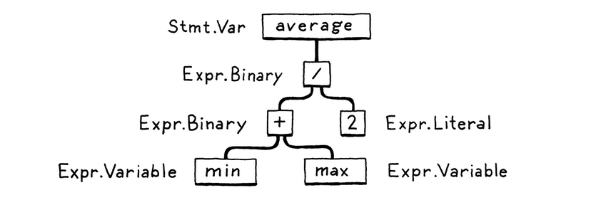
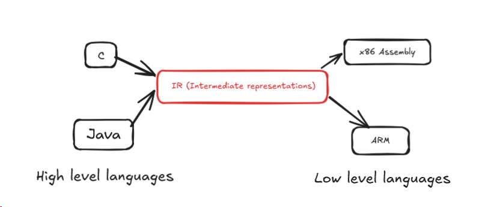

## Introduction
Hello! This is first actual blog post and im gonna talk about how a compiler or interpreter works. i combined the both because they work in the same way and you will understand what i mean later, Before i start i want to give credit to the [crafting interpreters](https://craftinginterpreters.com/) book for the inspiration and examples i used in this post.

## Lexical Analysis/Scanning
- It is the process where the scanner takes in a linear stream of characters we provide and turns them into chunk of words aka tokens. 
- Ex:- 'var' is a token and '(' is an token
## Parsing 
- It is used to give the tokens some grammar, by that i mean we build a kind of tree structure so that the code is understandable. Also the whitespaces and comments are ignored when we make the tree.
- An Example graph:

  
- The code has turned into a tree aka syntax trees or ASTs(Abstract syntax trees).
- The parser's job also includes letting us know when we have syntax errors.
## Static Analysis
- The first bit of analysis we do after parsing is binding/resolution, all of this depends on languages because it is different in every language from this point.
- For example, we know 'a + b' is a adding to b but we don't know if a and b are public/private and global/local so for that we do static analysis.
- For each token/identifier, we find where the variable is declared and and link them both. After linking, if something like type error for example is there then it will inform us about that error here.
## Intermediate representations
- It is the interface which acts between the source code and the backend(architecture).
- Some examples of already existing IRs are [control flow graph](https://en.wikipedia.org/wiki/Control-flow_graph)(the classic flow chart), [static single-assignment](https://en.wikipedia.org/wiki/Static_single-assignment_form), [continuation-passing style](https://en.wikipedia.org/wiki/Continuation-passing_style), [three-address code](https://en.wikipedia.org/wiki/Three-address_code).
- Shared IRs let us convert all types of frontend source codes like [C](https://en.wikipedia.org/wiki/C_(programming_language)), [Java](https://en.wikipedia.org/wiki/Java_(programming_language)) into a single shared IR where we do all the optimizations we require and then feed it to the backend to multiple hardware architectures like [x86](https://en.wikipedia.org/wiki/X86), [GPU](https://en.wikipedia.org/wiki/Graphics_processing_unit), [ARM](https://en.wikipedia.org/wiki/ARM_architecture), etc.

- For example the frontend code has [PASCAL](https://en.wikipedia.org/wiki/Pascal_(programming_language)) and C and the backend has x86 and ARM, we can do combinations like PASCAL->x86 or PASCAL->ARM easily with shared IR. A real life example where it is used is [GCC (C compiler)](https://en.wikipedia.org/wiki/GNU_Compiler_Collection) which supports all kinds of languages because of shared IR.
## Optimization
- Once we understand what the user's source code means, we are free to change into a different program which mean the same thing, but it is implemented more efficiently and for that we optimize it.
- For example if we write `Area = 3.14159 * (0.75 / 2) * (0.75 / 2);` in the source code, during the compile time it changes into `Area = 0.4417860938;` so resources are saved and execution time is reduced.
- Some optimization techniques are [constant propagation](https://en.wikipedia.org/wiki/Constant_propagation), [common subexpression elimination](https://en.wikipedia.org/wiki/Common_subexpression_elimination), [loop invariant code motion](https://en.wikipedia.org/wiki/Loop-invariant_code_motion), etc.
## Code generation
- After applying all kinds of optimizations, we come to the last step which is converting the the final program into a language which the CPU can understand like x86/ARM.
- We have two options here, convert it into code which our machine CPU can directly understand or create virtual machine code. Direct machine code is faster compared to virtual but it does not let us use the same code for different architectures like ARM and x86, it can only work with one of them. Instead if we used virtual machine code, we will get something called as [bytecode](https://en.wikipedia.org/wiki/Bytecode).
- Bytecode is a set of instructions which is designed to be very close to the language's semantics but it is not tied to any specific architecture.
## Virtual machine
- This is the step where we convert bytecode into machine code. Here we have two options to choose from as well.
- The first option is that we make multiple mini compilers that convert the bytecode into different architecture languages.
- The second option is to make a virtual machine which runs the code the way we want ideally and it can be ported to any device easily but at the cost of performance. This is how windows games work on Linux (via [Wine](https://en.wikipedia.org/wiki/Wine_(software))/[Proton](https://en.wikipedia.org/wiki/Proton_(software))). Instead of a new mini-compiler it just makes a virtual machine the program can run on and this is called as a "System Virtual Machine", it mimics an entire Operating system and the hardware required to run the software.
## Runtime
- After we successfully convert it to machine code, we have an executable file which we can run to do whatever the program contains.
- While we run a program, it needs some services that the language provides like garbage collector, automatic memory management, exception handling, etc.
- All of this goes into runtime, this is the phase where a program is actively running and doing various things at a time to complete the instructions it was given.
# *Shortcuts/Alternate routes*
Whatever i spoke in the previous section is how the languages usually work but there are some shortcuts people use.
## Single-Pass compilers
- Some compilers combine parsing, analysis and code generation so they never even make a tree or have any IRs.
- Some languages that are like this are C and PASCAL.
## Tree-walk interpreters
Some languages just make the tree then start executing the program by following the tree and running one node at a time and going to next level and so on. Early versions of [Ruby](https://en.wikipedia.org/wiki/Ruby_(programming_language)) were tree walkers.
## Transpilers/Transcompiler
- Usually we have a frontend, backend and an IR, but this route converts the back end into a valid source code which is similar to the high level language we are writing in the front end so that we skip writing the entire backend.
- In modern days, many high level languages convert their code into C since there are many C compilers to [UNIX](https://en.wikipedia.org/wiki/Unix).
- For browsers, the language it usually uses is JavaScript so many languages target to convert their code into JavaScript to avoid any backend work.
## Just-in-Time compilation
It is a shortcut route which experts use, they convert the program source code into machine code during the **runtime** instead of before execution.
## The difference between compiler and interpreter
The compiler converts the source code into an machine executable file and leaves it like that and we decide where to run it, what to do with it, etc. An interpreter converts the source code and immediately runs the executable file. Also an interpreter usually has some compiling going on inside it so an interpreter is technically both a compiler and interpreter.

## Conculusion
I hope i made some sense and you got to know how an compiler/interpreter works. It was simplified alot from the book :P
